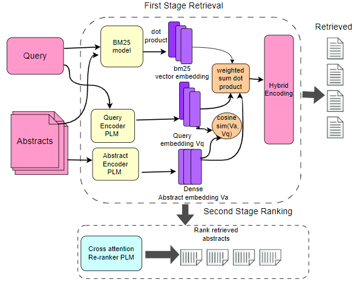

## A Zero-Shot Monolingual Dual Stage Information Retrieval System for Spanish Biomedical Systematic Literature Reviews (Accepted into NAACL 2024 Main Conference)

### Table of Contents
- [Abstract](#features)
- [Methodology](#installation)
- [Prerequisites](#usage)
- [Spanish SR Train/Test Dataset](#visualizing-attacks)
- [Models](#generating-adversarial-images)
- [Limitation](#limitation)

### Abstract

Systematic Reviews (SRs) are foundational in healthcare for synthesising evidence to inform clinical practices. Traditionally skewed towards English-language databases, SRs often exclude significant research in other languages, leading to potential biases. This study addresses this gap by focusing on Spanish, a language notably underrepresented in SRs. We present a foundational zero-shot dual information retrieval (IR) baseline system, integrating traditional retrieval methods with pre-trained language models and cross-attention re-rankers for enhanced accuracy in Spanish biomedical literature retrieval. Utilising the LILACS database, known for its comprehensive coverage of Latin American and Caribbean biomedical literature, we evaluate the approach with three real-life case studies in Spanish SRs. The findings demonstrate the system's efficacy and underscore the importance of query formulation. This study contributes to the field of IR by promoting language inclusivity and supports the development of more comprehensive and globally representative healthcare guidelines.

For more details, please check the latest version of the paper

### Methodology

###  Prerequisites
- Python 3.6
- PyTorch 1.3.1
- transformers

